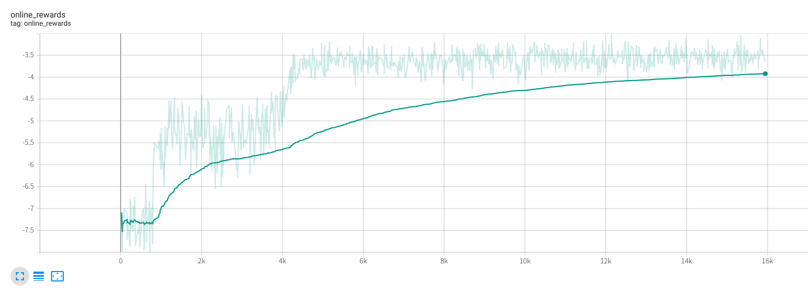
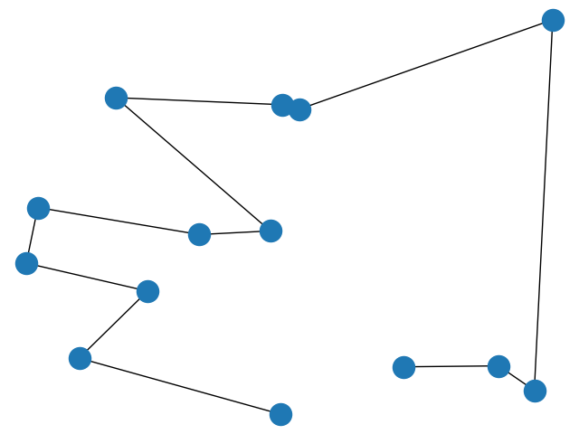
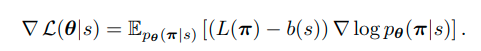
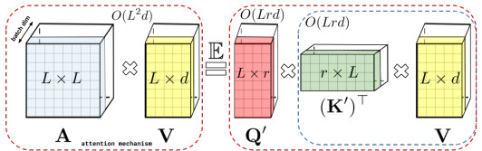

# Attention! Learn to Solve Routing Problems!

このリポジトリはWouterらの[巡回セールスマン問題をTransformer + 深層強化学習で解く論文](https://arxiv.org/abs/1803.08475)のTensorFlow2による再現実装と改良を加えたリポジトリです。

改良点はニューラルネットワークアーキテクチャを最新のものに変えた点で、dqn_main.pyに記載されているパラメータを変更することで
- [PreLayerNormalization](https://arxiv.org/abs/2002.04745)によってTransformer特有のWarmUpStageを削除できるようになったTransformerBlock
- [PreLayerNormalization + GateUnit](https://arxiv.org/abs/1910.06764)によってさらなる安定性をもったTransformerBlock

の２つから選べるようになっています。

# 使い方

```
python main.py
```
を実行すれば学習が開始されます。

```
tensorboard --logdir ./logs/
```

とすれば学習中のパフォーマンスを閲覧できます。


デフォルトではノード数は１００になっていますが以下に示すデモはノード数１４です。

単位正方形の中に一様乱数によって生成された１４のノードを巡回する経路の経路長を最小にすることがこのデモの課題です。

学習がうまくいけばonline_rewardは４を切ることになります。



※実際に学習したネットワークを使って作成した経路を確認するコードはこのリポジトリにはついていませんのでご容赦ください。

# Envについて

tspmdp/env.pyで実装されているTSPMDPクラスは巡回セールスマン問題の環境を提供します。

公開された全てのメソッドはtf.functionでデコレートされておりコンパイルされたグラフ上で高速計算されます。

これにより学習アルゴリズム全体もグラフ上で高速計算することが可能になっています。

高速計算と学習の安定化のために巡回セールスマン問題の環境はTensorflow + GPUによって並列計算できるようになっています。

バッチサイズ５００なら５００の巡回セールスマン問題インスタンスが同時に生成されます。

エージェントは５００のインスタンスに対してアクションを入力するのでバッチサイズ５００のアクションをEnvに入力しなければなりません。
このあたりは[A2C](https://arxiv.org/abs/1602.01783v2)に似ています。

# REINFORCE


にしたがって勾配を計算します。L(π), b(s)はそれぞれオンラインネットワーク、これまでのベストネットワークで巡回セールスマン問題を解いた際のコストでエージェントと上述のEnvとの相互作用によって計算されます。

勾配を計算しモデルを更新するトレーニングステップ全体がtf.functionによってグラフ上にコンパイルされています。

# DQN
このリポジトリで再現実装した先行研究はノード数nに対してメモリ計算量がQuadraticに増えていきます。

これを改善するためこのレポジトリでは分散型Deep Q Learningも実装しています(./tspmdp/dqn以下)。

分散型Q Learningは[Ape-X](https://arxiv.org/abs/1803.00933)を参考にしています。

Deep Q LearningはREINFORCEと違いStep単位での学習が可能なので、エピソードに渡って計算結果を維持する必要がなくなります。

しかし依然としてグラフを入力としたTransformerはQuadraticな計算量が必要になってしまうので最先端の線形計算量Transformerである[Performer](https://arxiv.org/abs/2009.14794)を導入しています。



ただしQLearningは学習が極めて不安定で、先行研究ほどの精度を出すにはいたっていません。

現在研究開発中です。